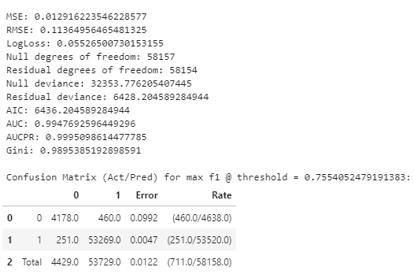
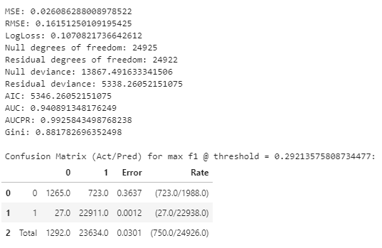

# Student Failure Detection using autoML

## Requirements
The requirements as libraries have been added in the notebooks.
Only the necessary libraries for the use of h2o are included.

1. Install or make sure you have **conda** installed. [Install Conda](https://docs.anaconda.com/anaconda/install/index.html)
2. Install **Java JDK** on conda: Execute the following command in conda prompt
    ```shell
    conda install -c conda-forge openjdk=11
    ```

## Data
Data are cleaned from Students data (failed/won courses) and National Educational Evaluation

### Data Understanding (On work)
Variables
```python
SUBJ_DESC=
CRSE_NUMBER=
GRDE_CODE_FINAL= 'Binary variable who defines if an studen fail the course (0) or passed (1)'
CRN_KEY=
CRED_ACAD=
COLL_DESC=
MAJR_DESC1=
CAMPUS=
IND_REP=
BECA_GOB_ICFES=
HAVE_BECA=
HAVE_PHONE=
PSC=
PMA=
PLC=
PIN=
PCN=
ICQU=
ICMA=
ICLE=
ICHI=
ICGE=
ICFL=
ICFI=
ICBI=
ICSO=
```

## Results
- Train

    
- Valid

    

- Best Variable: IND_REP
    This categorical variable determines whether a student has previously fail the course and repeats it again.

## Files

1. [Pandas Profiling Report](https://htmlpreview.github.io/?https://github.com/migeruj/SFD_Colombia/blob/main/Report.html)
2. [Model base](StackedEnsemble_BestOfFamily_AutoML_20210628_223625) trained using [train.csv](train.csv)
3. Notebooks for [train](Train.ipynb) process of using automl and select the best model, save and [reuse or prediction](Predict.ipynb)

## Recommendations

1. Export as Mojo file if the model's performance in the prediction process is required to improve. [About](http://docs.h2o.ai/h2o/latest-stable/h2o-docs/productionizing.html)
